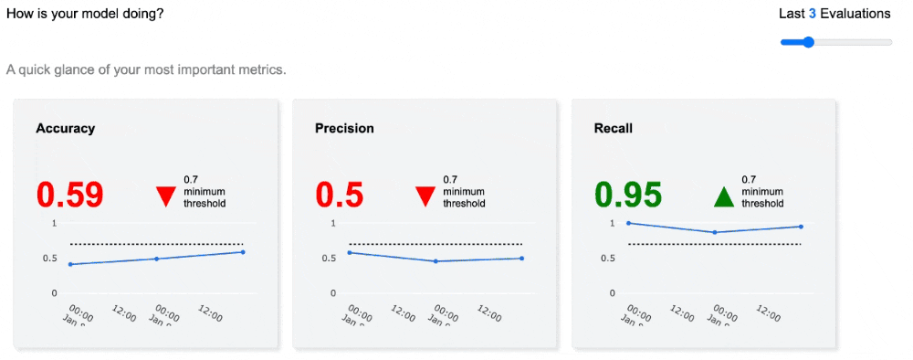
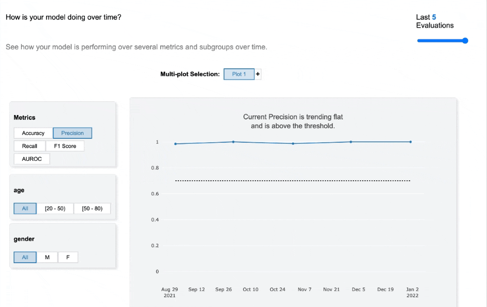
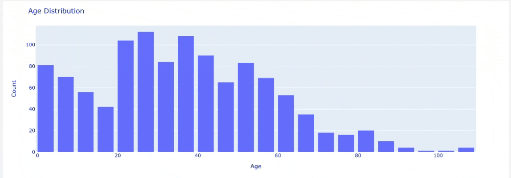
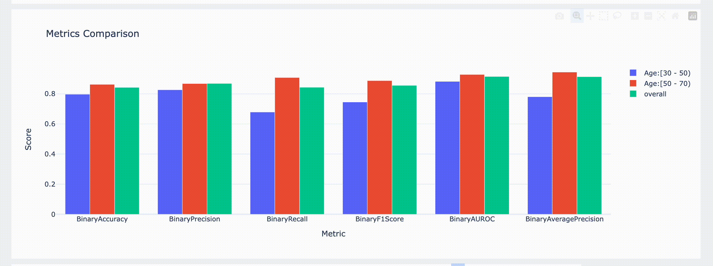

Monitoring
==========

Basically, after initial evaluation and report generation, you or your users may have the question that how to monitor model performance over time?
By evaluating the model on the dataset through time and generating reports, you will gain insights about the performance of model over time dimension. Cyclops allows users to select and view the number of latest evaluation.

Everytime an evaluation is performed and added to the report, a new entry is added to the report's `JSON` file and by doing so repeatedly, the users will be able to view the trend of performance over days, months, or hours.

Overview
--------

At top level and in a quick glance, there are overall performance metrics:

The number on top left of each figure indicates the metric value for latst evaluation, each with their corresponding timestamp on the X-axis. The figures are color coded base on a minimum threshold that was defined by developers. Once the metric for the latest evaluation drops below the threshold it's shown in red, and when everything is good, it appears in green.

And to get a better prespective about different slices (age intervals or sex) you have the option of multiple plots in a single figure:

Again, this plot has the feature of viewing a number of past evaluations using the slider at the top right.

Dataset
-------
In dataset section, you will be able to view all the plots that are generated to explore distribution of dataset features. By hovering on any part of the plot you see the detail about that feature. Also, the plots allows interaction such as zooming or panning:

Quantitative Analysis
---------------------
Quantitative analysis is somehow a subset of overview, where users are able to further investigate last evaluation results with extra metrics and plots for each slice of dataset.

Metric comparison charts are also a handy tool to compare how the model is performing in different subgroups and over all of them.

.. image:: examples/images/roc_curve_comparison.gif

Fairness Analysis
-----------------
