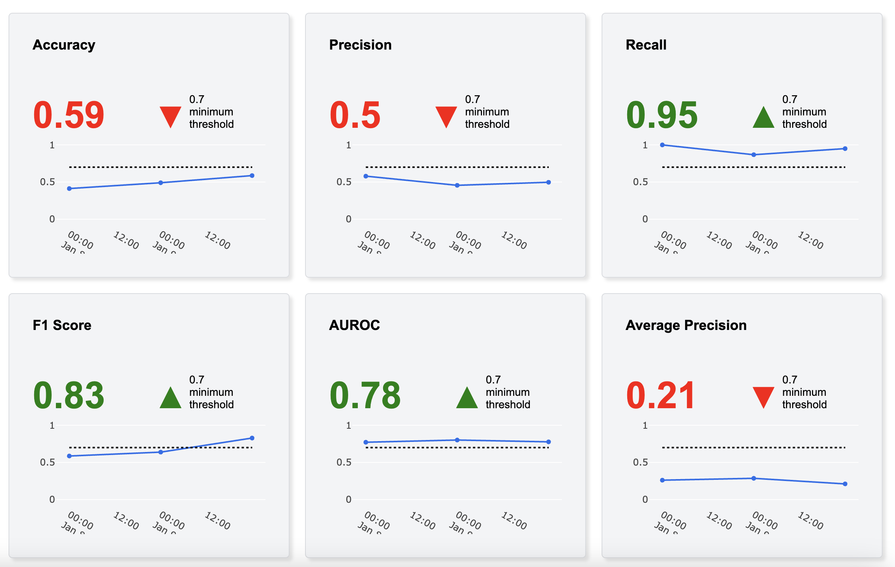
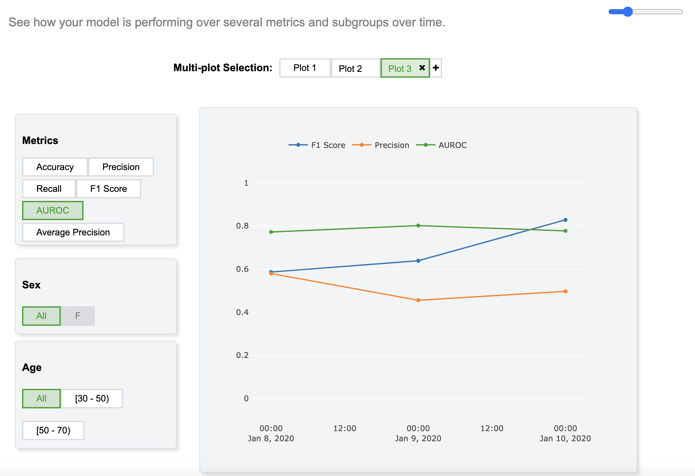
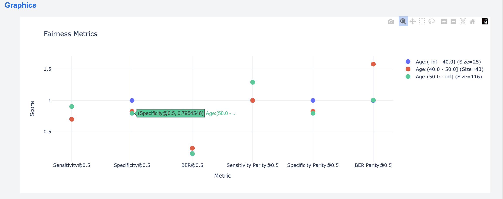
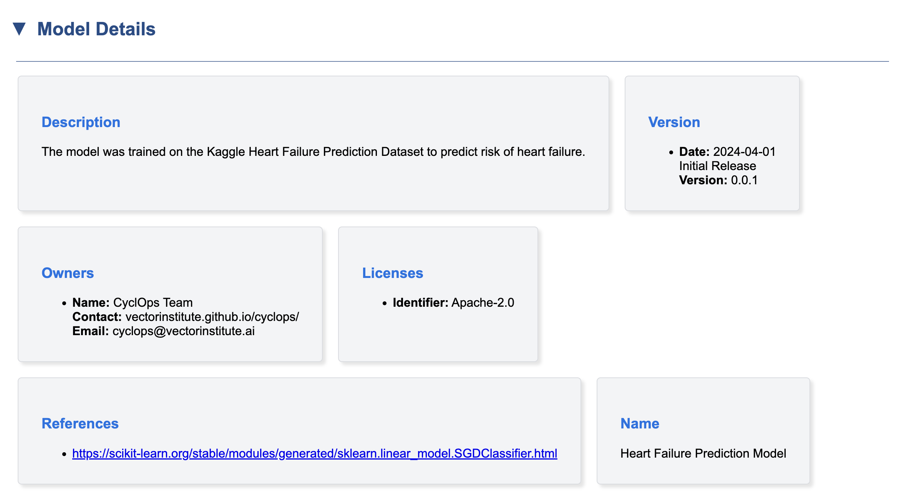
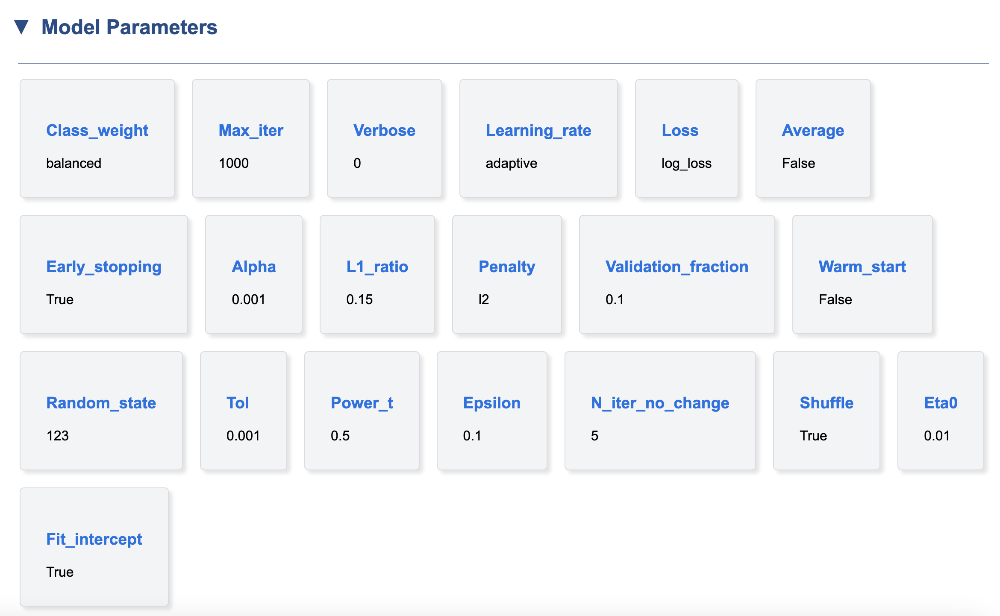
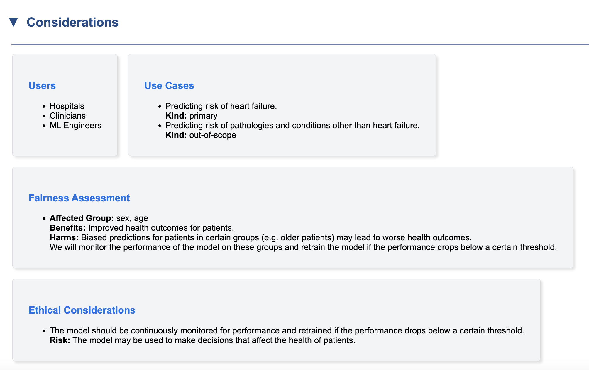

Model Report
============

The model report helps technicians, data scientists and clinicians to understand the model's performance better by offering:

    * Clear Visualizations: Effortlessly incorporate the generated figures from model evaluation into your report, providing a clear picture of model performance for everyone.

    * Detailed Model Specs: Document and view all relevant model details and parameters for easy reference.

    * Interactive Exploration: Gain insights into model performance across different subgroups over time. Interact with the plots to select specific subgroups and adjust displayed metrics.

    .. image:: examples/images/metrics_comparison.png

Let's dive into the key sections of a model report and explore what each one tells us. Depending on what developers have added to the model report, it may or may not have all the sections.

Overview
--------
This section provides a comprehensive overview of the various metrics used to evaluate the model's performance. Color-coded plots allow for quick visual identification of any significant changes in performance.

Report developers can tailor the number of metrics displayed in each plot to suit their needs. Additionally, users can access brief descriptions of each metric (e.g., Accuracy, F1 Score) by hovering over the corresponding title.

Additionally, Cyclops model report has this feature that you can conveniently view model performance on specific subgroups and add multiple metrics in a single plot:

The timestamp of each evaluation is on the X-axis, and each metric-slice is shown with a distinctive color.

In :doc:`Monitoring User Guide <monitoring>` you'll find instructions on how to interact with these plots.

Dataset
-------
In dataset section, you will be able to view all the plots that are generated to explore distribution of dataset features. By hovering on any part of the plot you see the detail about that feature. Also, the plots allow interactions such as zooming or panning:

.. image:: https://github.com/VectorInstitute/cyclops/assets/5112312/85186099-d932-4fe5-8ac6-ee06f4736a3a

Quantitative Analysis
---------------------
Quantitative analysis is the section where users can further investigate last evaluation results with extra metrics and plots for each slice of dataset.

.. image:: https://github.com/VectorInstitute/cyclops/assets/5112312/90500d21-94ba-4ede-b488-97669df21a6e

Metric comparison charts are also a handy tool to compare how the model is performing in different subgroups and over all of them.

.. image:: https://github.com/VectorInstitute/cyclops/assets/5112312/5a5f8300-18de-4737-918e-9d77c33a1ceb

Fairness Analysis
-----------------
Fairness analysis checks if the model's predictions are independent of a sensitive attribute, like age, race or gender. Ideally, the model should have the same outcome for all groups. This ensures the model isn't biased towards or against a particular group.

Here's a plot example you may see in Fairness Analysis section:

Model Details
-------------
Here you can view details and metadata about model, such as its description, developers/owners or external links to model Github repository or paper.

Model Parameters
----------------
Scientists or model developers may add model parameters in the model report in this section. This is an example:

Considerations
--------------
Considerations entails information about use cases of the model, ethical considerations, groups at risk, etc.

Follow the example below for the instructions on how to generate a model report:

.. toctree::

    examples/report.ipynb
